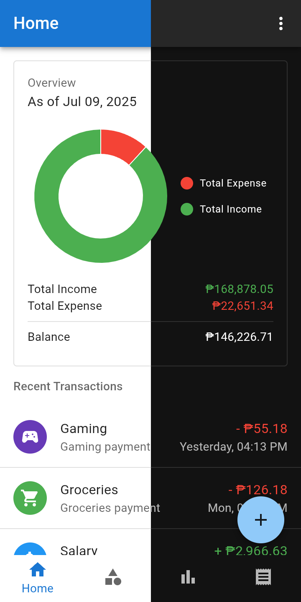
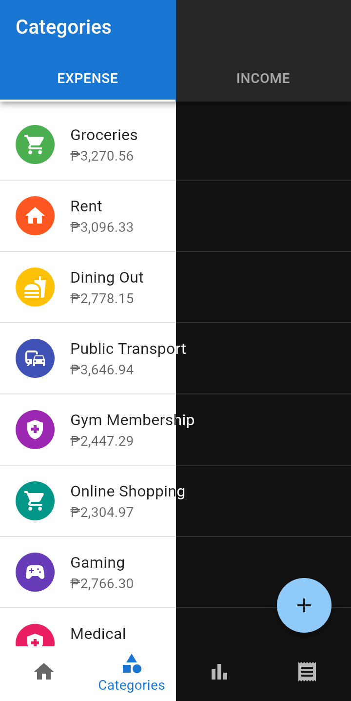
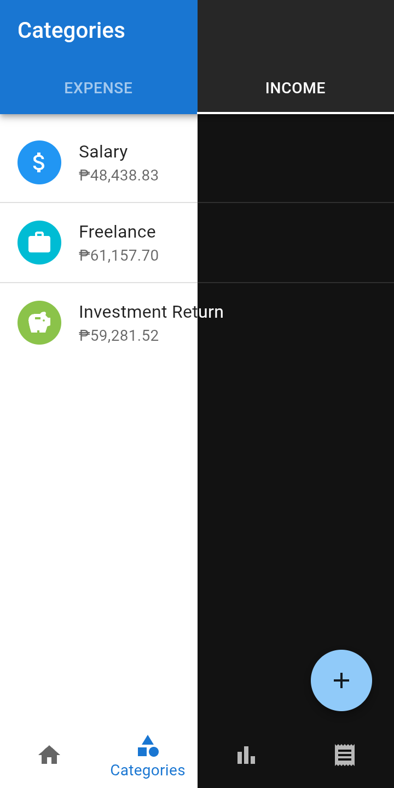

# Finance Tracker

Track your expenses and income with ease. Organize transactions, categorize your spending, and
visualize your financial habits — all in one place.

## 🚀 Key Features

- Organize income and expense categories
- Add detailed transactions with notes
- Visualize data with built-in analytics
- Quickly find past transactions using built-in search and filter options.

## Screenshots

  <table>
    <tr>
      <td></td>
      <td></td>
    </tr>
    <tr>
      <td></td>
      <td></td>
    </tr>
  </table>

## License

This project is licensed under the [MIT License](./LICENSE)
